# wrdle — Shaping

## Source

> Wordle is a wordle game, of the "phrase" modality. At each game there's a short phrase to discover. The user has to enter 5 words to guess characters of the phrase. Every word they guess reveals characters from the phrase. The interface looks like https://lapalabradeldia.com/frase/ There needs to a dictionary defined somewhere and I want words in spanish, catalan, and basque on it. There are 5 random sentences in spanish to be guessed, all initially hardcoded into a file.

> It's option A [any letter in the guessed word that appears anywhere in the phrase gets revealed in all its positions]. They need to be valid dictionary words. That's why we need to have actual basque, spanish, and catalan words defined in some file (and also their plurals, because that's also valid). If after 5 words the phrase isn't fully revealed the player gets another chance but they cannot go to the next phrase (the next level) until they guess it. And there's a keyboard on the bottom of the screen so that users can type the words.

---

## Problem

Standard Wordle guesses a single word. This variant guesses a hidden **phrase**: players submit valid dictionary words, and any letter that appears in the phrase is revealed across all its positions. The challenge is to uncover the full phrase using as few words as possible.

## Outcome

A playable phrase-Wordle game in the browser. Players work through 5 Spanish phrases in sequence, using Spanish/Catalan/Basque words to reveal letters, with an on-screen keyboard for input.

---

## Requirements (R)

| ID | Requirement | Status |
|----|-------------|--------|
| R0 | Player uncovers a hidden phrase by guessing valid dictionary words | Core goal |
| R1 | A guessed word must exist in the dictionary (Spanish, Catalan, or Basque + plurals) and be exactly 5 letters | Must-have |
| R2 | Every letter in the guessed word that appears in the phrase is revealed in all its positions in the phrase | Must-have |
| R3 | Player has 5 word guesses per attempt; if phrase not fully revealed after 5 they can retry (unlimited) but cannot advance to the next phrase until it is solved | Must-have |
| R4 | On-screen keyboard (A–Z + Ñ, QWERTY layout); letters are colored green if confirmed in phrase, gray if confirmed not in phrase, default if unused | Must-have |
| R5 | Game has 5 hardcoded Spanish phrases played as sequential levels | Must-have |
| R6 | Phrase display hides letters as blank tiles; spaces and punctuation are visible | Must-have |
| R7 | On win: confetti plays, full phrase appears centered; button below says "Next" (or "Start again" on last level) | Must-have |
| R8 | Win is automatic when all letters are revealed | Must-have |
| R9 | Phrases are played in the order they are defined in the JS array | Must-have |
| R10 | After a failed attempt (5 guesses, phrase not solved), phrase resets to fully hidden and guesses reset | Must-have |
| R11 | Each letter tile in a submitted guess row is colored green (letter is in phrase) or gray (letter not in phrase) | Must-have |

---

## Detail B: Breadboard

### Places

| # | Place | Description |
|---|-------|-------------|
| P1 | Game Screen | Main gameplay — phrase tiles, guess history, keyboard |
| P2 | Win Overlay | Blocking overlay shown on solve — confetti, phrase, next button |

---

### UI Affordances

| # | Place | Component | Affordance | Control | Wires Out | Returns To |
|---|-------|-----------|------------|---------|-----------|------------|
| U1 | P1 | phrase-display | Phrase tile grid — hidden chars as blanks, spaces/punct visible | render | — | — |
| U2 | P1 | guess-history | 5×5 grid of submitted word tiles; each letter colored green (in phrase) or gray (not in phrase) | render | — | — |
| U3 | P1 | word-input | Current 5-letter word being typed | render | — | — |
| U4 | P1 | keyboard | A–Z + Ñ QWERTY buttons; green = confirmed in phrase, gray = confirmed not in phrase, default = unused | render | — | — |
| U5 | P1 | keyboard | Letter button | click | → N4 | — |
| U6 | P1 | keyboard | Backspace button | click | → N5 | — |
| U7 | P1 | keyboard | Enter/Submit button | click | → N6 | — |
| U8 | P1 | word-input | Invalid word shake/feedback | render | — | — |
| U9 | P2 | win-overlay | Confetti animation | render | — | — |
| U10 | P2 | win-overlay | Full phrase centered on screen | render | — | — |
| U11 | P2 | win-overlay | "Next" button (last level: "Start again") | click | → N13 | — |

---

### Code Affordances

| # | Place | Component | Affordance | Control | Wires Out | Returns To |
|---|-------|-----------|------------|---------|-----------|------------|
| N1 | P1 | dictionary | `loadDictionary()` — merges es.txt + ca.txt + eu.txt into `Set<string>` at module init | call | → S1 | — |
| N2 | P1 | phrases | `phrases` — JS array of 5 hardcoded Spanish phrases | config | — | → N8 |
| N3 | P1 | App | `useGame()` — useReducer hook; exposes state + dispatch | call | → N8 | → S2, S3, S4, S5, S6, S7 |
| N4 | P1 | keyboard | `dispatch(APPEND_LETTER)` | call | → S4 | — |
| N5 | P1 | keyboard | `dispatch(BACKSPACE)` | call | → S4 | — |
| N6 | P1 | word-input | `dispatch(SUBMIT_WORD)` | call | → N7 | — |
| N7 | P1 | game reducer | `SUBMIT_WORD` handler — validate → reveal → check win/fail | call | → N9, → N10, → N11 | — |
| N8 | P1 | game reducer | `reducer(state, action)` — handles all actions | call | → S2, S3, S4, S5, S6, S7 | → N3 |
| N9 | P1 | game reducer | `validateWord(word)` — checks word is in S1 and exactly 5 letters | call | → U8 on fail | → N7 |
| N10 | P1 | game reducer | `computeReveal(word, phrase)` — splits letters into revealedChars (in phrase) and missedChars (not in phrase) | call | → S3, → S7 | → N7 |
| N11 | P1 | game reducer | `checkWin(phrase, revealedChars)` — all non-space/punct chars revealed? | call | → N12 on win, → N14 on 5th guess fail | → N7 |
| N12 | P1 | game reducer | `dispatch(WIN)` — sets gameStatus to 'won' | call | → S5, → N15 | — |
| N13 | P2 | win-overlay | `dispatch(NEXT_LEVEL)` — advances level (or wraps to 0), resets all attempt state | call | → S2, S3, S4, S5, S6, S7 | — |
| N14 | P1 | game reducer | `dispatch(RESET_ATTEMPT)` — clears guesses, revealedChars, missedChars; same level | call | → S2, S3, S4, S7 | — |
| N15 | P2 | win-overlay | `triggerConfetti()` — fires confetti animation | call | → U9 | — |

---

### Data Stores

| # | Place | Store | Description |
|---|-------|-------|-------------|
| S1 | P1 | `dictionary` | `Set<string>` — all valid words from all three language files |
| S2 | P1 | `guesses` | `string[]` — words submitted in current attempt (max 5) |
| S3 | P1 | `revealedChars` | `Set<string>` — chars from guesses confirmed to appear in phrase (shown green) |
| S4 | P1 | `currentInput` | `string` — letters typed so far for the current word |
| S5 | P1/P2 | `gameStatus` | `'playing' \| 'won'` — drives P1/P2 visibility |
| S6 | P1 | `currentLevel` | `number` (0–4) — index into phrases array |
| S7 | P1 | `missedChars` | `Set<string>` — chars from guesses confirmed NOT in phrase (shown gray) |

---

### Mermaid

```mermaid
flowchart TB
    subgraph P1["P1: Game Screen"]
        subgraph phraseDisplay["phrase-display"]
            U1["U1: Phrase tile grid"]
        end

        subgraph guessHistory["guess-history"]
            U2["U2: 5x5 guess tiles (green/gray per letter)"]
        end

        subgraph wordInput["word-input"]
            U3["U3: Current word display"]
            U8["U8: Invalid word feedback"]
        end

        subgraph keyboard["keyboard"]
            U4["U4: A-Z+Ñ buttons (green/gray/default)"]
            U5["U5: Letter button"]
            U6["U6: Backspace"]
            U7["U7: Enter/Submit"]
        end

        N1["N1: loadDictionary()"]
        N2["N2: phrases array"]
        N3["N3: useGame() / useReducer"]
        N4["N4: dispatch APPEND_LETTER"]
        N5["N5: dispatch BACKSPACE"]
        N6["N6: dispatch SUBMIT_WORD"]
        N7["N7: SUBMIT_WORD handler"]
        N8["N8: reducer()"]
        N9["N9: validateWord()"]
        N10["N10: computeReveal()"]
        N11["N11: checkWin()"]
        N12["N12: dispatch WIN"]
        N14["N14: dispatch RESET_ATTEMPT"]
    end

    subgraph P2["P2: Win Overlay"]
        U9["U9: Confetti animation"]
        U10["U10: Phrase centered"]
        U11["U11: Next / Start again button"]
        N13["N13: dispatch NEXT_LEVEL"]
        N15["N15: triggerConfetti()"]
    end

    S1["S1: dictionary Set"]
    S2["S2: guesses []"]
    S3["S3: revealedChars Set"]
    S4["S4: currentInput"]
    S5["S5: gameStatus"]
    S6["S6: currentLevel"]
    S7["S7: missedChars Set"]

    N1 --> S1
    N2 -.-> N8
    S1 -.-> N9

    U5 --> N4
    U6 --> N5
    U7 --> N6

    N4 --> S4
    N5 --> S4
    N6 --> N7

    N7 --> N9
    N7 --> N10
    N7 --> N11

    N9 -->|invalid| U8
    N9 -.-> N7
    N10 --> S3
    N10 --> S7
    N10 -.-> N7
    N11 -->|win| N12
    N11 -->|5th fail| N14
    N11 -.-> N7

    N12 --> S5
    N12 --> N15
    N14 --> S2
    N14 --> S3
    N14 --> S4
    N14 --> S7

    N8 --> S2
    N8 --> S3
    N8 --> S4
    N8 --> S5
    N8 --> S6
    N8 --> S7
    N8 -.-> N3

    S2 -.-> U2
    S3 -.-> U1
    S3 -.-> U2
    S3 -.-> U4
    S4 -.-> U3
    S5 -.-> P2
    S6 -.-> N8
    S7 -.-> U2
    S7 -.-> U4

    U11 --> N13
    N13 --> S2
    N13 --> S3
    N13 --> S4
    N13 --> S5
    N13 --> S6
    N13 --> S7
    N15 --> U9
    S3 -.-> U10

    classDef ui fill:#ffb6c1,stroke:#d87093,color:#000
    classDef nonui fill:#d3d3d3,stroke:#808080,color:#000
    classDef store fill:#e6e6fa,stroke:#9370db,color:#000
    class U1,U2,U3,U4,U5,U6,U7,U8,U9,U10,U11 ui
    class N1,N2,N3,N4,N5,N6,N7,N8,N9,N10,N11,N12,N13,N14,N15 nonui
    class S1,S2,S3,S4,S5,S6,S7 store
```

---

## A: Single hook + flat dictionary

| Part | Mechanism |
|------|-----------|
| A1 | Dictionary: one `dictionary.txt` file, all three languages merged, one word per line; loaded as a `Set<string>` at module init |
| A2 | Game state: `useGame` custom hook using multiple `useState` calls (currentLevel, guesses, revealedLetters) |
| A3 | Reveal logic: on word submit, iterate guessed word's letters; mark any that appear in phrase as revealed |
| A4 | Win detection: after each reveal, check if all non-space/punctuation characters are revealed; trigger confetti + next button |
| A5 | Fail detection: after 5th guess without win, reset revealedLetters and guesses |
| A6 | Phrase display: map phrase chars to tiles — revealed chars show, unrevealed show blank, spaces/punctuation always visible |
| A7 | On-screen keyboard: grid of letter buttons; letters used in any guess are visually marked |
| A8 | Phrases: exported JS array in `phrases.ts`; played in definition order |

---

## B: Reducer + per-language dictionary files

| Part | Mechanism |
|------|-----------|
| B1 | Dictionary: separate `es.txt`, `ca.txt`, `eu.txt` files; imported and merged into one `Set<string>` at module init |
| B2 | Game state: `useReducer` with typed actions (`SUBMIT_WORD`, `WIN`, `FAIL`, `NEXT_LEVEL`) and a single state object |
| B3 | Reveal logic: `SUBMIT_WORD` action computes new `revealedLetters` set and appends guess |
| B4 | Win/fail detection: handled in reducer — transitions to `won` or `failed` state; on `failed` state entry, state resets |
| B5 | Phrase display: same as A6 |
| B6 | On-screen keyboard: same as A7 |
| B7 | Phrases: same as A8 |

---

## Fit Check

| Req | Requirement | Status | A | B |
|-----|-------------|--------|---|---|
| R0 | Player uncovers a hidden phrase by guessing valid dictionary words | Core goal | ✅ | ✅ |
| R1 | A guessed word must exist in the dictionary (Spanish, Catalan, or Basque + plurals) and be exactly 5 letters | Must-have | ✅ | ✅ |
| R2 | Every letter in the guessed word that appears in the phrase is revealed in all its positions | Must-have | ✅ | ✅ |
| R3 | 5 guesses per attempt; can retry unlimited times but can't advance until solved | Must-have | ✅ | ✅ |
| R4 | On-screen keyboard (A–Z + Ñ, QWERTY layout); letters colored green/gray/default by phrase membership | Must-have | ✅ | ✅ |
| R5 | 5 hardcoded Spanish phrases as sequential levels | Must-have | ✅ | ✅ |
| R6 | Phrase display hides letters as blank tiles; spaces/punctuation visible | Must-have | ✅ | ✅ |
| R7 | On win: confetti, phrase centered, "Next" / "Start again" on last level | Must-have | ✅ | ✅ |
| R8 | Win is automatic when all letters are revealed | Must-have | ✅ | ✅ |
| R9 | Phrases played in definition order | Must-have | ✅ | ✅ |
| R10 | After failed attempt, phrase and guesses reset to fresh start | Must-have | ✅ | ✅ |
| R11 | Each letter tile in a submitted guess row is colored green (in phrase) or gray (not in phrase) | Must-have | ✅ | ✅ |

**Notes:**
- Both shapes satisfy all requirements. The difference is maintainability and clarity:
  - A is simpler and faster to build; dictionary language attribution is lost (all words in one file)
  - B makes language boundaries explicit (separate files, typed state machine); easier to add a language or debug validation later
