# wrdle — Slices

## Slice Summary

| # | Slice | Mechanisms | Demo |
|---|-------|------------|------|
| V1 | Type and reveal | B2 (state), B3 (reveal) | "Click letters, submit, see letters reveal in phrase" |
| V2 | Tile and keyboard coloring | B3 (visual) | "Guess tiles and keyboard show green/gray per letter" |
| V3 | Win detection + overlay | B4 (win) | "Reveal all phrase letters — confetti plays, overlay appears" |
| V4 | Level progression | B2 (levels) | "Win, click Next, phrase 2 starts fresh" |
| V5 | Fail and retry | B4 (fail) | "Use 5 guesses without winning — game resets fresh" |
| V6 | Dictionary validation | B1 | "Type unknown word — it shakes. Type valid word — accepted" |

---

## V1: Type and Reveal

Core mechanic. No validation, no win/fail detection, no coloring. Just: keyboard → input → submit → phrase reveals.

**Demo:** "Click letters on keyboard, press Enter, see letters revealed in the phrase."

### Affordances added

| # | Component | Affordance | Control | Wires Out | Returns To |
|---|-----------|------------|---------|-----------|------------|
| N2 | phrases | `phrases` array — 5 hardcoded Spanish phrases | config | — | → N8 |
| N8 | game reducer | `reducer(state, action)` | call | → S2, S3, S4, S6, S7 | → N3 |
| N3 | App | `useGame()` — useReducer hook | call | → N8 | → S2, S3, S4, S6, S7 |
| S6 | — | `currentLevel` (0–4) | store | — | → N8 |
| S4 | — | `currentInput` | store | — | → U3 |
| S2 | — | `guesses []` | store | — | → U2 |
| S3 | — | `revealedChars Set` | store | — | → U1 |
| S7 | — | `missedChars Set` | store | — | — |
| U1 | phrase-display | Phrase tile grid — blanks for hidden, spaces visible | render | — | — |
| U2 | guess-history | 5×5 guess tile grid (no coloring yet — all gray) | render | — | — |
| U3 | word-input | Current word being typed | render | — | — |
| U4 | keyboard | A–Z + Ñ QWERTY buttons (no coloring yet — all default) | render | — | — |
| U5 | keyboard | Letter button | click | → N4 | — |
| U6 | keyboard | Backspace button | click | → N5 | — |
| U7 | keyboard | Enter/Submit button | click | → N6 | — |
| N4 | keyboard | `dispatch(APPEND_LETTER)` — appends letter if input < 5 chars | call | → S4 | — |
| N5 | keyboard | `dispatch(BACKSPACE)` — removes last char | call | → S4 | — |
| N6 | word-input | `dispatch(SUBMIT_WORD)` — only if input is 5 chars | call | → N7 | — |
| N7 | game reducer | `SUBMIT_WORD` handler — appends guess, computes reveal | call | → N10 | — |
| N10 | game reducer | `computeReveal(word, phrase)` — splits into revealedChars (in phrase) and missedChars (not in phrase) | call | → S3, → S7 | → N7 |

---

## V2: Tile and Keyboard Coloring

Adds visual feedback: each letter in submitted guesses and on the keyboard is colored based on phrase membership.

**Demo:** "Submit a word — each tile goes green if the letter is in the phrase, gray if not. Keyboard keys update to match."

### Affordances enhanced

| # | Component | Affordance | Enhancement |
|---|-----------|------------|-------------|
| U2 | guess-history | Guess tiles | Each tile now reads S3 (green) and S7 (gray) to apply color |
| U4 | keyboard | Keyboard keys | Each key now reads S3 (green) and S7 (gray) for color state |

---

## V3: Win Detection + Overlay

Detects when all phrase letters are revealed and shows the win overlay with confetti. "Next" button for now just resets the same phrase (placeholder until V4).

**Demo:** "Keep guessing until the phrase is fully revealed — confetti plays, the phrase appears centered, a button shows."

### Affordances added

| # | Component | Affordance | Control | Wires Out | Returns To |
|---|-----------|------------|---------|-----------|------------|
| S5 | — | `gameStatus: 'playing' \| 'won'` | store | — | → P2 |
| N11 | game reducer | `checkWin(phrase, revealedChars)` — called after each SUBMIT_WORD | call | → N12 on win | → N7 |
| N12 | game reducer | `dispatch(WIN)` — sets gameStatus to 'won' | call | → S5, → N15 | — |
| N15 | win-overlay | `triggerConfetti()` | call | → U9 | — |
| U9 | win-overlay | Confetti animation | render | — | — |
| U10 | win-overlay | Full phrase centered on screen | render | — | — |
| U11 | win-overlay | "Next" button (placeholder: resets same phrase) | click | → N13 | — |
| N13 | win-overlay | `dispatch(NEXT_LEVEL)` — placeholder: resets to same phrase | call | → S2, S3, S4, S5, S7 | — |

---

## V4: Level Progression

Replaces the placeholder Next with real level advancement. Clicking Next goes to the next phrase; on the last level the button says "Start again" and wraps to level 0.

**Demo:** "Win phrase 1, click Next — phrase 2 starts. Win all 5, click Start again — phrase 1 starts again."

### Affordances updated

| # | Component | Affordance | Update |
|---|-----------|------------|--------|
| N13 | win-overlay | `dispatch(NEXT_LEVEL)` — now increments S6 (wraps 4 → 0), clears all attempt state | call |
| U11 | win-overlay | Button label — reads S6 to show "Next" vs "Start again" | render |

---

## V5: Fail and Retry

After 5 failed guesses, the game resets to a fresh state for the same phrase.

**Demo:** "Submit 5 words without fully revealing the phrase — everything resets: phrase goes blank, guesses clear."

### Affordances added

| # | Component | Affordance | Control | Wires Out | Returns To |
|---|-----------|------------|---------|-----------|------------|
| N14 | game reducer | `dispatch(RESET_ATTEMPT)` — clears guesses, revealedChars, missedChars, currentInput | call | → S2, S3, S4, S7 | — |

### Affordances updated

| # | Component | Affordance | Update |
|---|-----------|------------|--------|
| N11 | game reducer | `checkWin()` — also dispatches RESET_ATTEMPT when 5th guess fails without win | call |

---

## V6: Dictionary Validation

Words must exist in the multilingual dictionary and be exactly 5 letters. Invalid submissions shake and are rejected.

**Demo:** "Type 'XZQWP' — tiles shake, word rejected. Type 'GATOS' — accepted and processed."

### Affordances added

| # | Component | Affordance | Control | Wires Out | Returns To |
|---|-----------|------------|---------|-----------|------------|
| N1 | dictionary | `loadDictionary()` — merges es.txt + ca.txt + eu.txt into Set<string> at module init | call | → S1 | — |
| S1 | — | `dictionary Set<string>` | store | — | → N9 |
| N9 | game reducer | `validateWord(word)` — checks word is in S1 and is 5 letters | call | → U8 on fail | → N7 |
| U8 | word-input | Invalid word shake / feedback | render | — | — |

### Affordances updated

| # | Component | Affordance | Update |
|---|-----------|------------|--------|
| N7 | game reducer | `SUBMIT_WORD` handler — now calls N9 before N10; aborts if invalid | call |

---

## Full Breadboard (all slices)

```mermaid
flowchart TB
    subgraph P1["P1: Game Screen"]
        subgraph phraseDisplay["phrase-display"]
            U1["U1: Phrase tile grid"]
        end
        subgraph guessHistory["guess-history"]
            U2["U2: 5x5 guess tiles (green/gray)"]
        end
        subgraph wordInput["word-input"]
            U3["U3: Current word display"]
            U8["U8: Invalid word feedback"]
        end
        subgraph keyboard["keyboard"]
            U4["U4: A-Z+Ñ buttons (green/gray/default)"]
            U5["U5: Letter button"]
            U6["U6: Backspace"]
            U7["U7: Enter/Submit"]
        end
        N1["N1: loadDictionary()"]
        N2["N2: phrases array"]
        N3["N3: useGame() / useReducer"]
        N4["N4: dispatch APPEND_LETTER"]
        N5["N5: dispatch BACKSPACE"]
        N6["N6: dispatch SUBMIT_WORD"]
        N7["N7: SUBMIT_WORD handler"]
        N8["N8: reducer()"]
        N9["N9: validateWord()"]
        N10["N10: computeReveal()"]
        N11["N11: checkWin()"]
        N12["N12: dispatch WIN"]
        N14["N14: dispatch RESET_ATTEMPT"]
    end

    subgraph P2["P2: Win Overlay"]
        U9["U9: Confetti animation"]
        U10["U10: Phrase centered"]
        U11["U11: Next / Start again"]
        N13["N13: dispatch NEXT_LEVEL"]
        N15["N15: triggerConfetti()"]
    end

    S1["S1: dictionary Set"]
    S2["S2: guesses []"]
    S3["S3: revealedChars Set"]
    S4["S4: currentInput"]
    S5["S5: gameStatus"]
    S6["S6: currentLevel"]
    S7["S7: missedChars Set"]

    N1 --> S1
    S1 -.-> N9
    N2 -.-> N8
    U5 --> N4
    U6 --> N5
    U7 --> N6
    N4 --> S4
    N5 --> S4
    N6 --> N7
    N7 --> N9
    N7 --> N10
    N7 --> N11
    N9 -->|invalid| U8
    N9 -.-> N7
    N10 --> S3
    N10 --> S7
    N10 -.-> N7
    N11 -->|win| N12
    N11 -->|5th fail| N14
    N11 -.-> N7
    N12 --> S5
    N12 --> N15
    N14 --> S2
    N14 --> S3
    N14 --> S4
    N14 --> S7
    N8 --> S2
    N8 --> S3
    N8 --> S4
    N8 --> S5
    N8 --> S6
    N8 --> S7
    N8 -.-> N3
    S2 -.-> U2
    S3 -.-> U1
    S3 -.-> U2
    S3 -.-> U4
    S4 -.-> U3
    S5 -.-> P2
    S6 -.-> N8
    S7 -.-> U2
    S7 -.-> U4
    U11 --> N13
    N13 --> S2
    N13 --> S3
    N13 --> S4
    N13 --> S5
    N13 --> S6
    N13 --> S7
    N15 --> U9
    S3 -.-> U10

    classDef ui fill:#ffb6c1,stroke:#d87093,color:#000
    classDef nonui fill:#d3d3d3,stroke:#808080,color:#000
    classDef store fill:#e6e6fa,stroke:#9370db,color:#000
    class U1,U2,U3,U4,U5,U6,U7,U8,U9,U10,U11 ui
    class N1,N2,N3,N4,N5,N6,N7,N8,N9,N10,N11,N12,N13,N14,N15 nonui
    class S1,S2,S3,S4,S5,S6,S7 store
```

